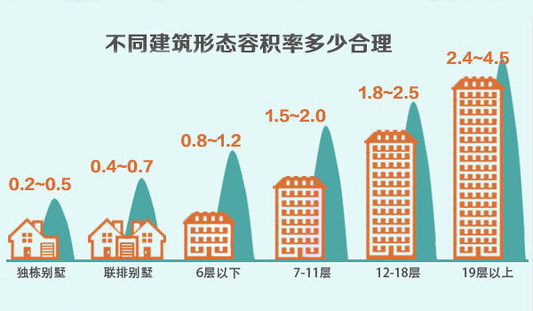
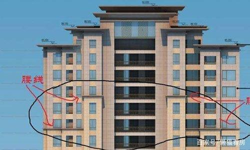
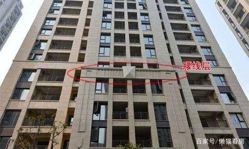

# 关于房子需要知道的一些概念

## 用地性质
[点击查看百度百科](https://baike.baidu.com/item/%E7%94%A8%E5%9C%B0%E6%80%A7%E8%B4%A8)

## 容积率
容积率（Plot Ratio/Floor Area Ratio/Volume Fraction）是指一个小区的地上总建筑面积与净用地面积的比率。又称建筑面积毛密度。对于开发商来说，容积率决定地价成本在房屋中占的比例，而对于住户来说，容积率直接涉及到居住的舒适度。一个良好的居住小区，高层住宅容积率应不超过5，多层住宅应不超过3，绿地率应不低于30%。但由于受土地成本的限制，并不是所有项目都能做得到。
[点击查看更多](https://baike.baidu.com/item/%E5%AE%B9%E7%A7%AF%E7%8E%87)

|建筑形式|高品质,低容积率|中品质，中容积率|低品质，高容积率|
|:---:|:---:|:---:|:---:|
|独栋双拼别墅|小于0.3|0.3~0.4|大于0.4|
|联排别墅|0.5~0.6|0.6~0.7|0.7~0.9|
|4、5层叠加|0.7~0.8|0.8~0.9|0.9~1.1|
|6层多层|1.1~1.3|1.3~1.5|1.5~1.7|
|11层小高层|1.7~2.0|2.0~2.2|2.2~2.5|
|18层高层|2.2~2.5|2.5~2.7|2.7~3.2|
|高层100m以内|3.2~4.0|4.0~5.0|5.0~6.0|
|摩天大楼|6.0以上|-|-|

## 定金、订金、诚意金、认筹金区别
|分类|定义|是否可以无条件退款|
|:---:|:---|:---:|
|定金|定金是在合同订立或在履行之前支付的一定数额的金钱作为担保的担保方式，又称保证金 《担保法》第八十九条当事人可以约定一方向对方给付定金作为债权的担保。 债务人履行债务后，定金应当抵作价款或者收回。给付定金的一方不履行约定的债务的， 无权要求返还定金;收受定金的一方不履行约定的债务的，应当双倍返还定金。 |无权要求返还定金|
|订金|在购房者与发展商就房屋买卖的意向初步达成协议后，准备进一步协商签订的临时认购协议， 通常的做法是在约定所选房号、面积、房屋单价及总价款后，约定一个期限，买方需在此期限 内与卖方签署正式合同。买方支付订金即取得了在此期限内的优先购买权。一般情况下，视作预付款。 预付款不具有担保债的履行的作用，也不能证明合同的成立。预付款在合同正常履行的情况下,成为价 款的一部分,在合同没有得到履行的情况下,不管是给付一方当事人违约,还是接受方违约,预付款都要原数返回。 |无条件退款|
|认筹金|“认筹”就是购房者表现出买房的诚意，这个诚意需要通过缴纳“认筹金”来体现。在缴纳“认筹金”后， 购房者可以获得房屋的优先购买权，并在房价上享受一定程度的优惠。等到楼盘正式开盘销售时， “认筹”的购房者再以“优先选择”的顺序选房，选中房屋后与开发商签订正式的房屋买卖合同。 如果购房者没有选中理想的房屋，开发商将把“认筹金”如数退还给购房者。但是“认筹金”的实质 作用是开发商在开盘前得到的大笔资金并在短时期内收回大笔资金，解决开发商的燃眉之急。 |无条件退款|
|诚意金|即意向金，这在中介与买房和卖房双方签定的合同中多有体现，其实法律上并没有诚意金之说， 中介与买卖双方之所以签定什么诚意金条款，主要是由于我们交易市场的诚实信用体系还不健全， 交易主体为了各自的利益往往会违背诚实信用的原则，从而损害一方的利益。|无条件退款| 
综上所述，后三者都是可以无条件退款的，即使是这样，签订任何条款是也要看清楚，要留心眼。例如在房产中介门店看房时，如果需要付意向金的话，只要收下房产中介开具的收据即可。对于房产中介人员提出的签订协议的要求，一定要慎重，如果房屋买卖双方仅仅是想建立一个定房关系的话，在签约时，可以要求中介公司将“居间协议”附件“房屋买卖协议”划掉，以保护自己的权益。

## 绿化率

### 什么是绿化率

大家在现在的楼盘宣传上经常可以看到对小区绿化率的描述，但是绿化率只是开发商宣传楼盘绿化时用的概念，并没有法律和法规依据。开发商在统计绿化率时，没有太多严格的限制，哪怕只有一块普通的草皮，都可以计入绿化率。购房人要注意房地产商在销售楼盘时宣传的绿化率实际不少是绿化覆盖率而非绿地率。

### 小区绿化率计算方式

绿化率的计算方法和解释都是比较简单的，绿化率计算公式：绿化率＝绿地面积／规划建设土地面积。这里的绿地面积包括公共绿地、宅旁绿地、公共服务设施所属绿地（道路红线内的绿地），不包括屋顶、晒台的人工绿地。公共绿地内占地面积不大于百分之一的雕塑、水池、亭榭等绿化小品建筑可视为绿地。

### 小区绿化率多少合适

国家对绿化率还是有规定的，现在的小区建设与从前最大的差别就是对环境的要求更高了。一般绿化率较高，容积率较低，建筑密度一般也就较低，而住户就越舒服。一个良好的居住小区，高层住宅容积率应不超过5，多层住宅应不超过3，绿化率应不低于30％。

### 绿地率和绿化率有哪些区别？

**1、计算方法不同**

绿地率的计算方法比较严格，通常以下限控制为原则。绿化率＝绿化面积／规划建设用地面积，而绿地率＝绿地总和／规划建设用地面积。此外，因为绿化率中所包括的范围比较广，而绿地率的范围比较窄，所以一般经过计算之后，绿化率比绿地率要高。

**2、标准不同**

绿化率相对于绿地率的计算范围更大，所以绿化率的标准比较高。绿化覆盖率是指绿化垂直投影面积之和与小区用地的比率，相对而言比较宽泛，所以绿化覆盖率有时可达到60％以上。而绿地率相对来说更严格，长草的地方并不一定都能算作绿地，绿地率主要包括公共绿地、宅旁绿地、配套公建所属绿地和道路绿地等。

以上这些就是对小区绿化的介绍了，小区绿化不只是要注意绿化率，还要注意小区植物的搭配，是不是四季都可以见到绿色的植物；小区绿化是不是经常有人打理；小区的绿化是不是会对业主的居住产不良的影响等。大家在考察小区绿化的时候一定要多注意这些问题，并不是绿化越多就越好。

## 腰线房

对于买房这件事，相信除了房价的讨论之外，还有就是对于房屋风水和楼层选择的讨论了。对于房屋的楼层选择来说，我们通常会说到什么扬灰层等等，但是你知道还有一个腰线房的说法吗?更是一种住房不住道边房，买房不买腰线房的俗语。那么什么是腰线房，腰线房都有哪些风险呢?

### 什么是腰线房？

腰线房就是指开发商为了装饰住宅楼梯而搞得一些特殊的弯梁，一般来说就是那种隔几层就突出来那种的房屋类型，外面看起来相对美观，不是那种一线到底直板板的形象。

### 腰线房的危害有哪些?

**1、腰线房很容易出现渗水的情况**

因为腰线房是突出的那部分房子，那么这样的房子必然会受到更多的风吹日晒，雨水也容易被风吹进室内，长期以来室内就很容易发霉。如果你要是哪天忘了关窗户的话，那么这个家里可得遭殃了。

**2、主卧以及阳台都会出现严重的缩水情况**

由于房型的突出部分，自然会影响到自己家主卧和阳台的面积，并且因为有遮挡，采光方面也会受到很大的影响。人家是全落地阳台，你因为突出来有个顶只能是半落地了。

**3、腰线房在户型的设计上也是存在安全问题**

因为是突出的房型，外立面有很多突出的地方，对于低楼层的一些住户来说，这就给小偷提供了一些落脚的地方，更加方便小偷进入了。同时据说在一些卫生条件不好的小区，老鼠肆虐也很正常。

### 腰线房也有一定的优点

既然腰线房有那么多缺点，为什么还是有人会去买腰线房呢?其实，有这么设计自然就有一定存在的道理，开发商不会平白无故这么搞的，如果没有需求没有钱挣，谁要费这个功夫呢?所以，腰线房又有哪些优点呢?

第一、多出的部分阳台比较看起来比较宽阔，那么对于一些喜欢养些花花草草，小鸟或者宠物的朋友来说，多出的这部分是个很好的空间。尤其近年来各种高空坠物伤人的事情频发，这样的一个空间我们可以选择把它打造成一个空中花园。

第二、因为阳台是突出来，半幅空间的，而且往往这些腰线房的造型在设计之初都使用了保温隔热的材料。所以，对这些房型来说，因为有这么一个突出的地方，反而可以进行一个很好的隔绝，达到大家想要的冬暖夏凉效果，可能住着感觉更舒服，因为有一些遮挡也不用忍受太阳的直射。

最后，每一种东西的存在肯定都是有着它的道理，以追求利润作为本质的房地产开发商自然也不会做无用的工作。不过由于现在的很多房子，都是预售制度，我们在买房时候根本不知道自己的房子会不会是腰线房，而且开发商也不会主动告诉你这些缺点。所以，你如果不是很喜欢腰线房的话，在买房的时候最好还是了解清楚，免得到时很苦恼哦。