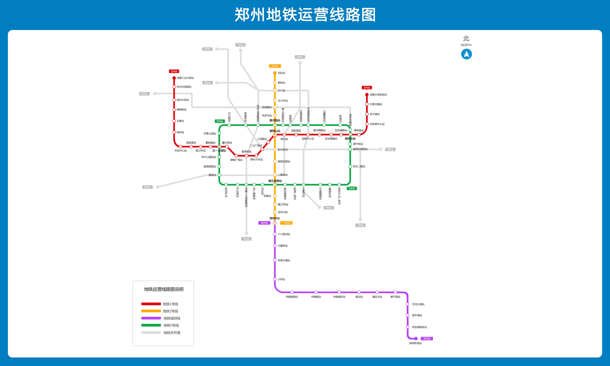
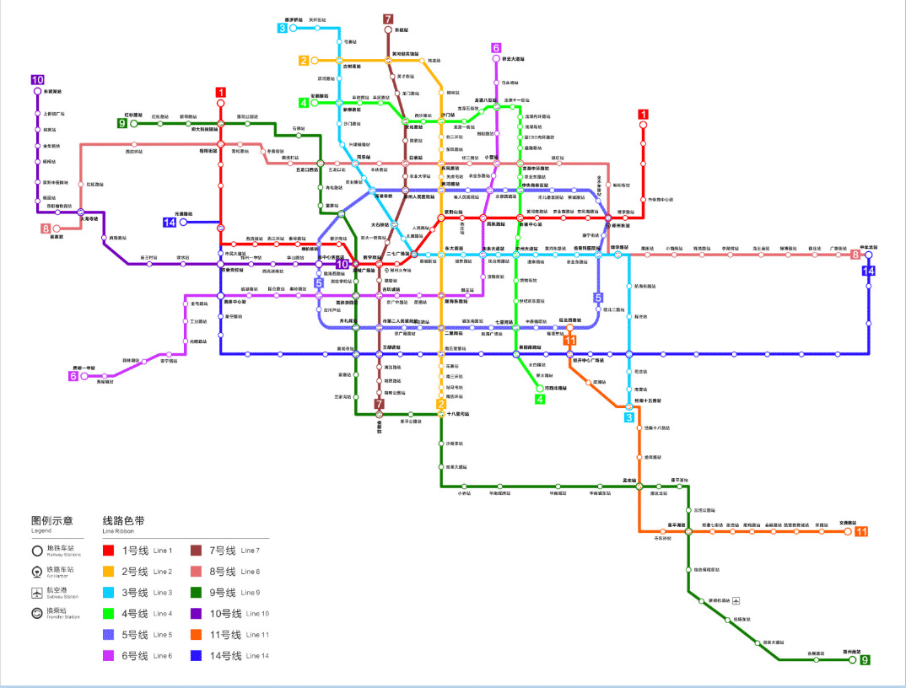

# 地铁规划

## 已开通路线

## 规划中路线

|线路|起点|终点|开工时间|通车时间|
|:---:|:---:|:---:|:---:|:---:|
|3号线|古荥站|经南十五路|2015年|2020年|
|4号线|安顺路|河西北路|2016年12月|2020年12月|
|6号线|贾峪镇站|祥云大道站|暂时未知|暂时未知|
|7号线|东赵|绕城|暂时未知|暂时未知|
|8号线|崔寨站|中牟县|暂时未知|暂时未知|
|9号线二期|花柏路与金菊西街交叉口|十八里河站|暂时未知|暂时未知|
|10号线|上街机场站|郑州火车站|暂时未知|暂时未知|
|11号线|经开第八大街站|郑港六路站|暂时未知|暂时未知|
|12号线|绿博北|祥瑞路|暂时未知|暂时未知|
|13号线|白沙北|港区南|暂时未知|暂时未知|
|14号线|铁炉站|中牟|2016年年底|2019年7月底|
|15号线|马寨站|新密站|暂时未知|暂时未知|
|16号线|鼎瑞街|新郑|暂时未知|暂时未知|
|17号线|商贸次中心|双鹤湖|暂时未知|暂时未知|
|18号线|新郑|东赵|暂时未知|暂时未知|
|19号线|东赵|银鱼路|暂时未知|暂时未知|
|20号线|金达路|中牟|暂时未知|暂时未知|
|21号线|上街机场站|生命谷南路站|暂时未知|暂时未知|